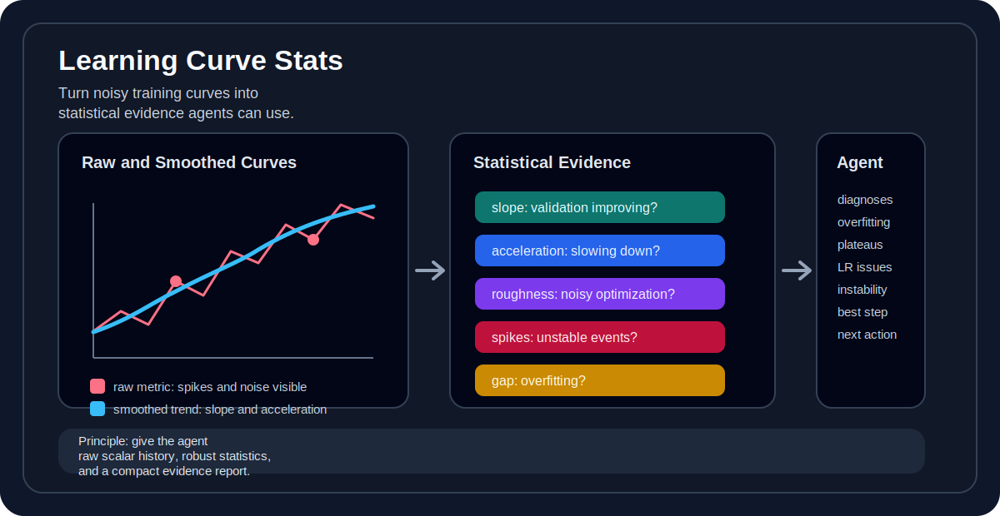
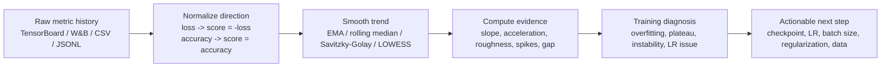

# Learning Curve Stats Skill

[](SKILL.md)
[](LICENSE)
[](SKILL.md)

**让 AI 不只是“看训练曲线”，而是用统计证据理解训练过程。**

`learning-curve-stats` 是一个面向 Codex / Claude / AI coding agent 的轻量 skill。它告诉 agent：面对 TensorBoard、W&B、MLflow、CSV、JSONL 或训练日志里的 learning curve 时，应该先把曲线转成可解释的统计量，再判断收敛、过拟合、震荡、平台期、最佳 checkpoint 和下一步调参方向。



## Why This Exists

很多训练曲线看起来“差不多”，但真实含义完全不同：

- validation loss 停了，是正常收敛，还是学习率太低？
- train loss 还在降，validation metric 不动，是过拟合，还是验证集太小？
- 曲线很抖，是 batch 太小、LR 太高，还是只是 RL/reward 本身方差大？
- 最后一个 checkpoint 真的是最好的吗？
- 新方法比 baseline 好，还是只是在一个 seed 上刚好运气好？

这个 skill 的目标是让 agent 避免凭肉眼猜图，而是输出类似这样的证据：

```json
{
  "diagnosis": "overfitting_after_step_4200",
  "best_step": 3900,
  "recent_val_slope": -0.0008,
  "train_val_gap_slope": 0.0031,
  "roughness": "medium",
  "spike_count": 2,
  "recommendation": "use earlier checkpoint, add regularization, or reduce training length"
}
```

## What The Agent Learns To Do



The important rule is simple:

> The agent should prefer raw scalar histories over screenshots. A chart is useful, but the diagnosis should come from numbers.

## Statistical Tools And What They Reveal

| Statistical tool | What it measures | What the agent can infer |
| --- | --- | --- |
| `EMA` / moving average | Smooth trend behind noisy points | Whether training is actually improving or only fluctuating |
| `rolling_median` | Robust trend under occasional spikes | Whether bad batches or evaluation outliers are distorting the curve |
| `Savitzky-Golay` / LOWESS | Smooth curve suitable for derivatives | Local slope, acceleration, inflection, warmup behavior |
| `slope = d(score)/d(step)` | Improvement speed | Still learning, plateaued, or getting worse |
| `early_slope`, `mid_slope`, `late_slope` | Stage-wise learning speed | Whether learning slows down normally or stalls too early |
| `acceleration = d2(score)/d(step)^2` | Whether improvement is speeding up or slowing down | Warmup effects, scheduler response, approaching convergence |
| `residual_std` | Noise around the smoothed trend | Noisy optimization, small batch, unstable validation, high-variance reward |
| `roughness = mean(abs(second difference))` | Curve jaggedness | Learning rate too high, unstable data pipeline, mixed precision issues |
| `spike_count` / `max_spike` | Sudden abnormal jumps | Bad batches, overflow, evaluation nondeterminism, logging bugs |
| `sign_change_rate` | How often trend direction flips | Oscillation, unstable optimization, noisy metric |
| `max_drawdown` | Drop from previous best score | Checkpoint sensitivity and risk of using final checkpoint |
| `plateau_detected` | Recent slope close to zero | Stop training, change LR, or increase capacity/data |
| `best_step` | Best validation point | Which checkpoint should be selected |
| `overtraining_steps` | Steps trained after best validation | Waste after peak, possible overfitting |
| `train_val_gap` | Difference between train and validation behavior | Generalization gap, overfitting, underfitting |
| `gap_slope` | Whether the gap is growing | Overfitting onset and severity |
| `mean_curve` / `std_curve` | Multi-seed average and variance | Whether a method is robust or just lucky |
| `confidence_interval` | Uncertainty around a run group | Whether a method beats baseline beyond seed noise |

## Agent 可以通过统计手段获得什么信息

| Agent 想回答的问题 | 推荐统计手段 | 能获得的信息 |
| --- | --- | --- |
| 训练还在有效学习吗？ | recent slope, improvement per 1k steps, remaining gain | 最近阶段是否仍有实质提升，是否值得继续训练 |
| 是否进入平台期？ | plateau detection, late slope, recent-window regression | 从哪一步开始收益变小，是否应该停训或调整 scheduler |
| 是否过拟合？ | train-validation gap, gap slope, best validation step | train 继续变好但 validation 变差的起点和严重程度 |
| 曲线是否太抖？ | residual std, roughness, rolling std, sign-change rate | 优化是否不稳定，LR/batch/eval 方差是否可能有问题 |
| 有没有异常 spike？ | robust residual threshold, MAD, max spike | 是否存在坏 batch、数值溢出、评估 nondeterminism 或日志异常 |
| 学习速度是在变快还是变慢？ | acceleration, stage-wise slope | warmup/scheduler 是否生效，模型是否接近收敛 |
| 最佳 checkpoint 是哪一个？ | best_step, max drawdown, overtraining steps | final checkpoint 是否可靠，是否应该回滚到验证集最佳点 |
| 新方法真的比 baseline 好吗？ | matched-budget comparison, mean/std across seeds, confidence interval | 提升是否超过 seed 方差，是否只是单次实验运气好 |
| 是欠拟合还是训练不足？ | train slope, validation slope, gap size, final metric | 模型容量、训练时长、学习率或数据是否可能不足 |
| 该调什么超参？ | slope + roughness + gap combined diagnosis | LR、batch size、regularization、scheduler、训练长度的优先级 |

## How To Read The Numbers

### Slope

The skill normalizes metrics into a higher-is-better `score`.

- `slope > 0`: model is improving.
- `slope ~= 0`: model has likely plateaued.
- `slope < 0`: validation behavior is getting worse.

For loss curves, the skill flips the sign first:

```text
score = -loss
```

So a positive score slope still means the loss is decreasing.

### Acceleration

Acceleration tells whether learning speed is changing.

- `acceleration > 0`: improvement is speeding up, often after warmup.
- `acceleration ~= 0`: linear progress or flat region.
- `acceleration < 0`: improvement is slowing, often near convergence.

Because acceleration is sensitive to noise, the skill tells the agent to estimate it from a smoothed curve and report it by window, not as a single fragile point.

### Roughness And Residual Noise

Roughness answers: “Is this curve hard to trust?”

High roughness or residual noise can suggest:

- learning rate too high
- batch size too small
- noisy validation set
- RL/reward variance
- unstable data pipeline
- mixed precision overflow or bad batches

Low roughness is not always good. If the metric is smooth but not improving, the model may be underfitting or the learning rate may be too low.

### Train-Validation Gap

The skill makes the agent align train and validation metrics by step before comparing them.

Typical interpretations:

- Train and validation both improve, gap stable: healthy convergence.
- Train improves, validation worsens, gap grows: overfitting.
- Both train and validation are bad: underfitting, optimization issue, or insufficient training.
- Validation is better than train: possible with dropout, augmentation, label smoothing, or easier validation data.

## Example Diagnoses

### Healthy Convergence

```text
Evidence:
- validation score slope remains positive but decreases smoothly
- train-validation gap is stable
- roughness is low to medium
- best checkpoint is close to final checkpoint

Diagnosis:
healthy_convergence

Action:
continue if recent slope is still meaningful; otherwise stop or reduce LR.
```

### Overfitting

```text
Evidence:
- train score keeps improving
- validation score slope becomes negative
- train-validation gap slope is positive
- best_step is much earlier than final_step

Diagnosis:
overfitting_after_best_step

Action:
use the best validation checkpoint, add regularization, improve data, or stop earlier.
```

### Learning Rate Too High

```text
Evidence:
- roughness is high
- spike_count is high
- sign_change_rate is high
- validation drawdown after local best is large

Diagnosis:
unstable_optimization_or_lr_too_high

Action:
lower LR, increase batch size, add gradient clipping, inspect bad batches.
```

### Learning Rate Too Low

```text
Evidence:
- roughness is low
- early and late slope are both tiny
- validation does not improve enough
- train-validation gap is small

Diagnosis:
slow_underfit_or_lr_too_low

Action:
increase LR, improve scheduler, train longer, or increase model capacity.
```

## Recommended Agent Report

When the skill is triggered, the agent should produce a compact report like this:

```markdown
## Learning Curve Diagnosis

Data source: TensorBoard scalar history
Metric direction: lower-is-better loss, normalized as score = -loss
Smoothing: EMA span = 25

Findings:
- Best validation loss: 0.83 at step 3900
- Recent validation slope: near zero, plateau detected after step 4300
- Train-validation gap: growing after step 4100
- Roughness: medium, 2 large spikes

Diagnosis:
The run starts healthy, then overfits after roughly step 4100.

Next action:
Use the checkpoint around step 3900, shorten training, and test stronger regularization.
```

## Installation

Copy this folder into your Codex skills directory or another skill registry your agent can load:

```bash
git clone https://github.com/Bardli/learning-curve-stats-skill.git
```

Then ask your agent to use the skill when analyzing training curves:

```text
Use the learning-curve-stats skill to analyze these TensorBoard metrics.
Tell me whether the run is overfitting, plateaued, unstable, or still improving.
```

## Supported Inputs

The skill is format-agnostic. It tells the agent what to compute once scalar histories are available.

Good inputs:

- TensorBoard event files
- W&B run history
- MLflow metric history
- `metrics.csv`
- `metrics.jsonl`
- training logs with parseable step/metric pairs
- curve screenshots, only when raw scalar data is unavailable

## What This Skill Is Not

This repo currently contains the AI skill instructions, not a full metric parser or plotting CLI. It is designed to guide an agent that can already read files, run Python/R, or query experiment trackers.

A future version could add scripts for:

- TensorBoard event extraction
- W&B history export
- automatic curve plotting
- JSON evidence report generation
- multi-seed aggregation

## License

MIT
