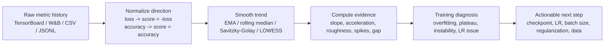
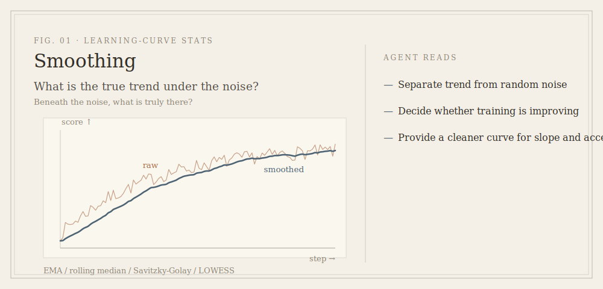
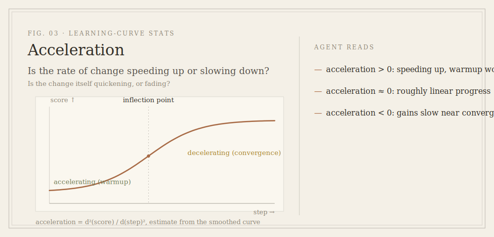
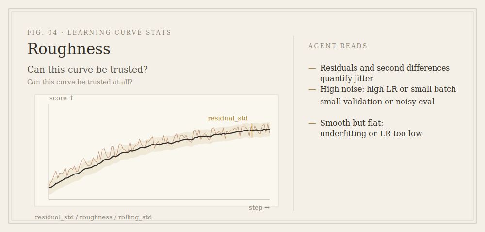
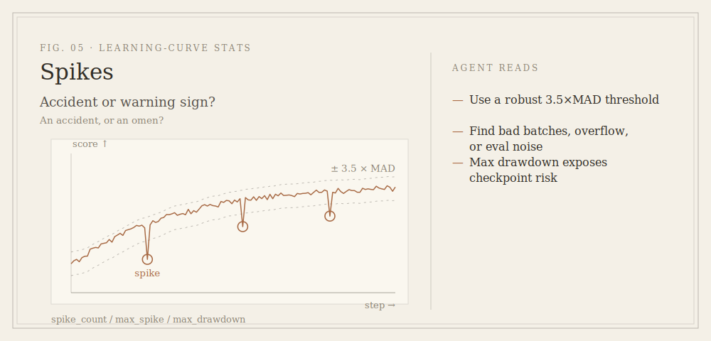
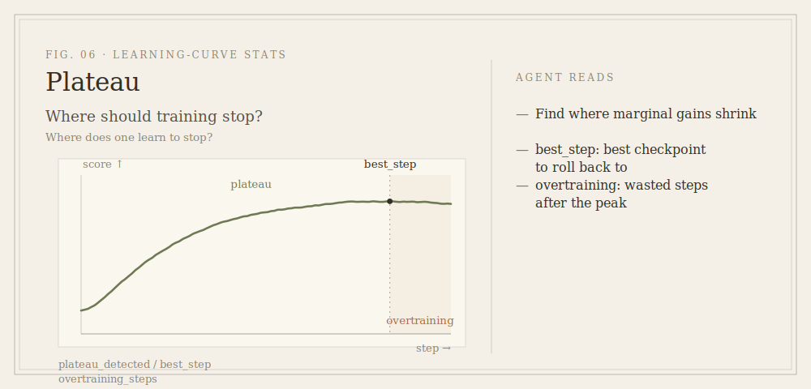
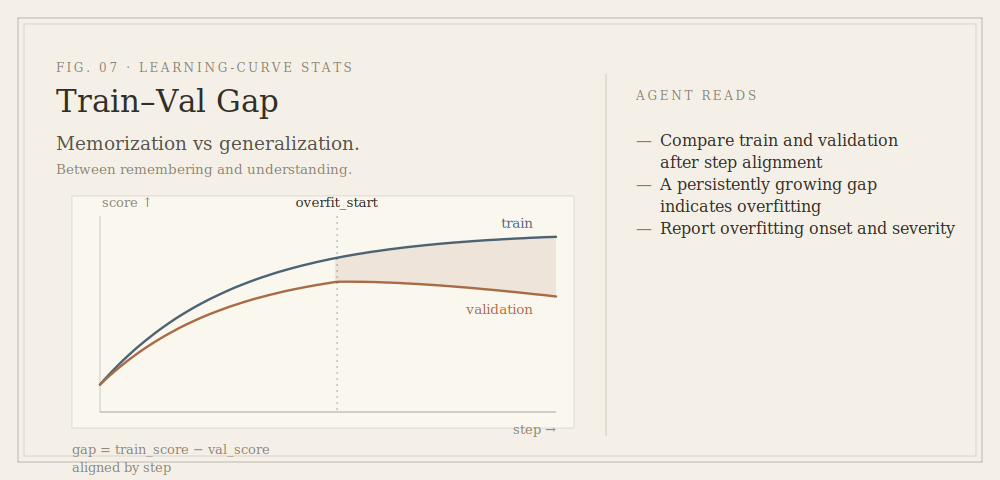
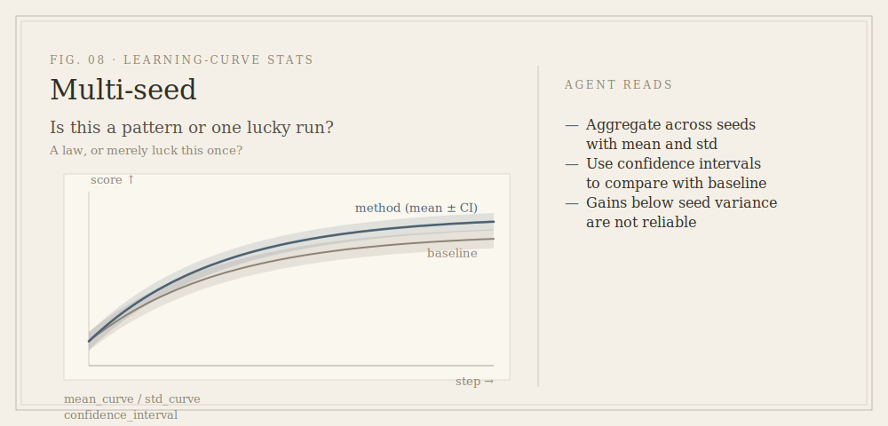

# Learning Curve Stats Skill

[](SKILL.md)
[](LICENSE)
[](SKILL.md)

Teach AI agents to analyze training curves with statistical evidence, not visual guesswork.

[Read this in Simplified Chinese](README.zh-CN.md)

`learning-curve-stats` is a lightweight skill for Codex, Claude, and other AI coding agents. It tells the agent how to turn TensorBoard, W&B, MLflow, CSV, JSONL, or training-log metric histories into interpretable statistics before diagnosing convergence, overfitting, instability, plateauing, checkpoint choice, and next tuning steps.


## Why This Exists

Many learning curves look similar while meaning very different things:

- Did validation loss plateau because the model converged, or because the learning rate is too low?
- If train loss keeps falling but validation stops improving, is that overfitting or just a tiny validation set?
- Is a noisy curve caused by a high learning rate, a small batch size, RL reward variance, or nondeterministic evaluation?
- Is the final checkpoint really better than the earlier best checkpoint?
- Did a new method beat the baseline, or did one seed just get lucky?

This skill pushes the agent toward evidence like this:

```json
{
  "diagnosis": "overfitting_after_step_4200",
  "best_step": 3900,
  "recent_val_slope": -0.0008,
  "train_val_gap_slope": 0.0031,
  "roughness": "medium",
  "spike_count": 2,
  "recommendation": "use earlier checkpoint, add regularization, or reduce training length"
}
```

## What The Agent Learns To Do



Core rule:

> Prefer raw scalar histories over screenshots. A chart is useful, but the diagnosis should come from numbers.

## Visual Guide

Each statistic is a question put to the curve. The left side shows a typical learning-curve shape; the right side shows what an agent can infer from it.

### Smoothing


### Slope


### Acceleration


### Roughness And Noise


### Spikes And Instability


### Plateau And Best Checkpoint


### Train-Validation Gap


### Multi-Seed Comparison


## Statistical Tools And What They Reveal

| Statistical tool | What it measures | What the agent can infer |
| --- | --- | --- |
| `EMA` / moving average | Smooth trend behind noisy points | Whether training is actually improving or only fluctuating |
| `rolling_median` | Robust trend under occasional spikes | Whether bad batches or evaluation outliers are distorting the curve |
| `Savitzky-Golay` / LOWESS | Smooth curve suitable for derivatives | Local slope, acceleration, inflection, warmup behavior |
| `slope = d(score)/d(step)` | Improvement speed | Still learning, plateaued, or getting worse |
| `early_slope`, `mid_slope`, `late_slope` | Stage-wise learning speed | Whether learning slows down normally or stalls too early |
| `acceleration = d2(score)/d(step)^2` | Whether improvement is speeding up or slowing down | Warmup effects, scheduler response, approaching convergence |
| `residual_std` | Noise around the smoothed trend | Noisy optimization, small batch, unstable validation, high-variance reward |
| `roughness = mean(abs(second difference))` | Curve jaggedness | Learning rate too high, unstable data pipeline, mixed precision issues |
| `spike_count` / `max_spike` | Sudden abnormal jumps | Bad batches, overflow, evaluation nondeterminism, logging bugs |
| `sign_change_rate` | How often trend direction flips | Oscillation, unstable optimization, noisy metric |
| `max_drawdown` | Drop from previous best score | Checkpoint sensitivity and risk of using final checkpoint |
| `plateau_detected` | Recent slope close to zero | Stop training, change LR, or increase capacity/data |
| `best_step` | Best validation point | Which checkpoint should be selected |
| `overtraining_steps` | Steps trained after best validation | Waste after peak, possible overfitting |
| `train_val_gap` | Difference between train and validation behavior | Generalization gap, overfitting, underfitting |
| `gap_slope` | Whether the gap is growing | Overfitting onset and severity |
| `mean_curve` / `std_curve` | Multi-seed average and variance | Whether a method is robust or just lucky |
| `confidence_interval` | Uncertainty around a run group | Whether a method beats baseline beyond seed noise |

## What The Agent Can Answer

| Question | Recommended evidence | Information gained |
| --- | --- | --- |
| Is training still useful? | recent slope, improvement per 1k steps, remaining gain | Whether more training is likely to pay off |
| Has the run plateaued? | plateau detection, late slope, recent-window regression | Where marginal gains shrink and whether to stop or change scheduler |
| Is the model overfitting? | train-validation gap, gap slope, best validation step | When validation starts diverging from train behavior |
| Is the curve too noisy? | residual std, roughness, rolling std, sign-change rate | Whether LR, batch size, validation variance, or logging might be unstable |
| Are there abnormal spikes? | robust residual threshold, MAD, max spike | Bad batches, numeric overflow, nondeterministic eval, or logging failures |
| Is learning speeding up or slowing down? | acceleration, stage-wise slope | Whether warmup/scheduler behavior makes sense and whether convergence is near |
| Which checkpoint should be used? | best_step, max drawdown, overtraining steps | Whether the final checkpoint is safe or rollback is better |
| Did a method really beat baseline? | matched-budget comparison, mean/std across seeds, confidence interval | Whether the improvement is larger than seed variance |
| Is this underfitting or just undertraining? | train slope, validation slope, gap size, final metric | Whether capacity, training length, LR, or data quality is the likely issue |
| What should be tuned next? | combined slope + roughness + gap diagnosis | Priority among LR, batch size, regularization, scheduler, or training length |

## How To Read The Numbers

### Metric Direction

Normalize each metric into a higher-is-better `score` before interpreting shape:

```text
loss-like metric: score = -metric
accuracy-like metric: score = metric
```

This keeps slope and gap interpretations consistent across losses, accuracy, Dice, IoU, F1, reward, perplexity, and error rates.

### Slope

- `slope > 0`: the model is improving.
- `slope ~= 0`: the model has likely plateaued.
- `slope < 0`: validation behavior is getting worse.

Use a regression line over a window rather than single-point differences when the metric is noisy.

### Acceleration

- `acceleration > 0`: improvement speed is increasing, often after warmup.
- `acceleration ~= 0`: linear progress or a flat region.
- `acceleration < 0`: improvement is slowing, often near convergence.

Acceleration is sensitive to noise, so estimate it from the smoothed curve and report it by window.

### Roughness And Residual Noise

High roughness or residual noise can suggest:

- learning rate too high
- batch size too small
- noisy validation set
- high-variance reward
- unstable data pipeline
- mixed precision overflow or bad batches

Low roughness is not always good. If the curve is smooth but not improving, the model may be underfitting or the learning rate may be too low.

### Train-Validation Gap

Align train and validation metrics by step before comparing them.

- Train and validation both improve, gap stable: healthy convergence.
- Train improves, validation worsens, gap grows: overfitting.
- Both train and validation are poor: underfitting, optimization issue, insufficient training, or data trouble.
- Validation better than train can happen with dropout, augmentation, label smoothing, or easier validation data.

## Example Diagnoses

### Healthy Convergence

```text
Evidence:
- validation score slope remains positive but decreases smoothly
- train-validation gap is stable
- roughness is low to medium
- best checkpoint is close to final checkpoint

Diagnosis:
healthy_convergence

Action:
continue if recent slope is still meaningful; otherwise stop or reduce LR.
```

### Overfitting

```text
Evidence:
- train score keeps improving
- validation score slope becomes negative
- train-validation gap slope is positive
- best_step is much earlier than final_step

Diagnosis:
overfitting_after_best_step

Action:
use the best validation checkpoint, add regularization, improve data, or stop earlier.
```

### Learning Rate Too High

```text
Evidence:
- roughness is high
- spike_count is high
- sign_change_rate is high
- validation drawdown after local best is large

Diagnosis:
unstable_optimization_or_lr_too_high

Action:
lower LR, increase batch size, add gradient clipping, inspect bad batches.
```

### Learning Rate Too Low

```text
Evidence:
- roughness is low
- early and late slope are both tiny
- validation does not improve enough
- train-validation gap is small

Diagnosis:
slow_underfit_or_lr_too_low

Action:
increase LR, improve scheduler, train longer, or increase model capacity.
```

## Recommended Agent Report

```markdown
## Learning Curve Diagnosis

Data source: TensorBoard scalar history
Metric direction: lower-is-better loss, normalized as score = -loss
Smoothing: EMA span = 25

Findings:
- Best validation loss: 0.83 at step 3900
- Recent validation slope: near zero, plateau detected after step 4300
- Train-validation gap: growing after step 4100
- Roughness: medium, 2 large spikes

Diagnosis:
The run starts healthy, then overfits after roughly step 4100.

Next action:
Use the checkpoint around step 3900, shorten training, and test stronger regularization.
```

## Installation

```bash
git clone https://github.com/Bardli/learning-curve-stats-skill.git
```

Then ask your agent:

```text
Use the learning-curve-stats skill to analyze these TensorBoard metrics.
Tell me whether the run is overfitting, plateaued, unstable, or still improving.
```

## Supported Inputs

- TensorBoard event files
- W&B run history
- MLflow metric history
- `metrics.csv`
- `metrics.jsonl`
- training logs with parseable step/metric pairs
- curve screenshots, only when raw scalar data is unavailable

## What This Skill Is Not

This repo currently contains the AI skill instructions, not a full metric parser or plotting CLI. It is designed to guide an agent that can already read files, run Python/R, or query experiment trackers.

A future version could add scripts for TensorBoard extraction, W&B export, automatic plotting, JSON evidence reports, and multi-seed aggregation.

## License

MIT
