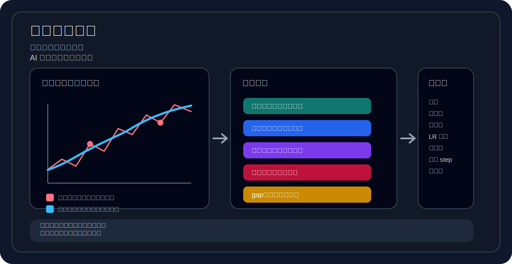
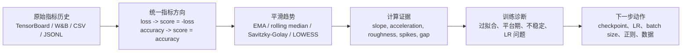
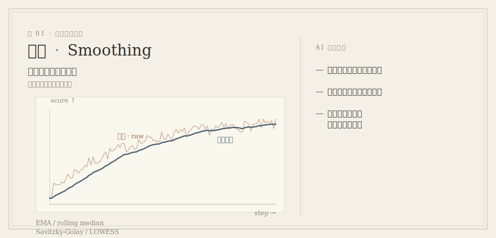
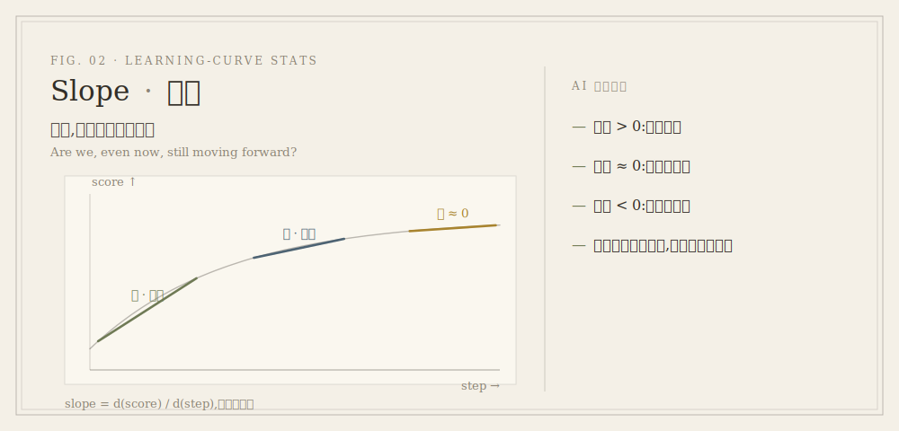
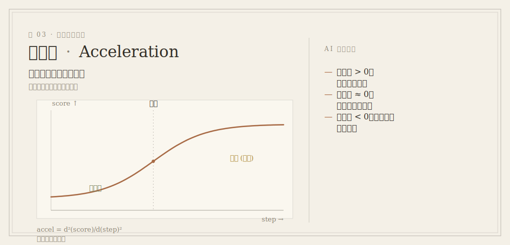
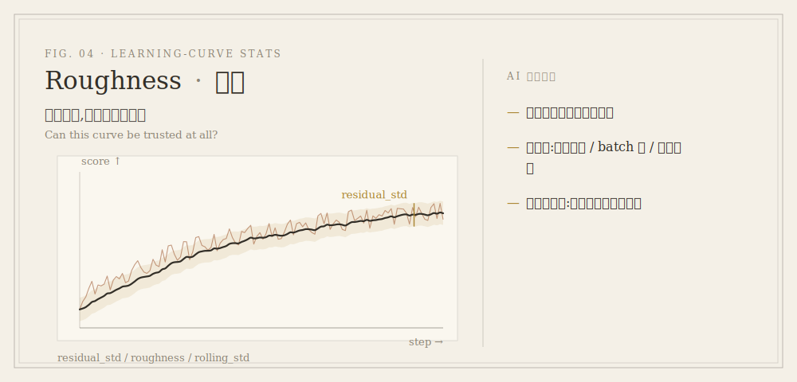
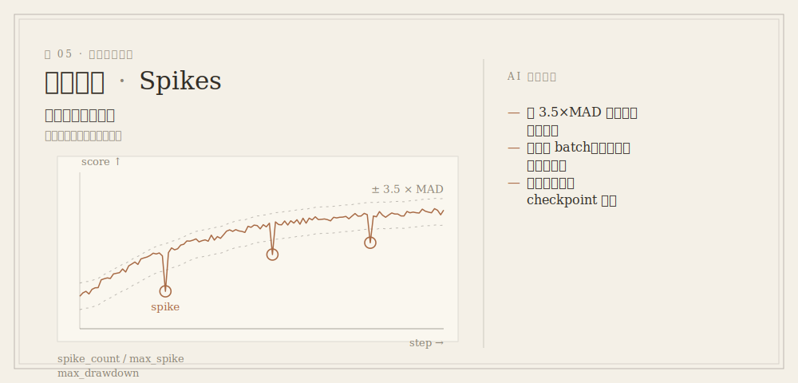
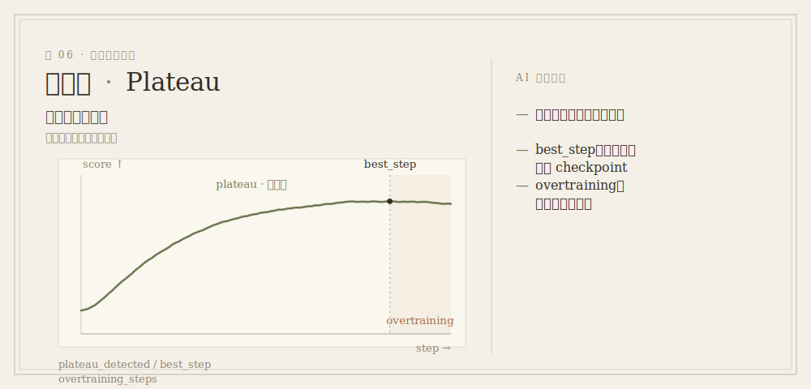
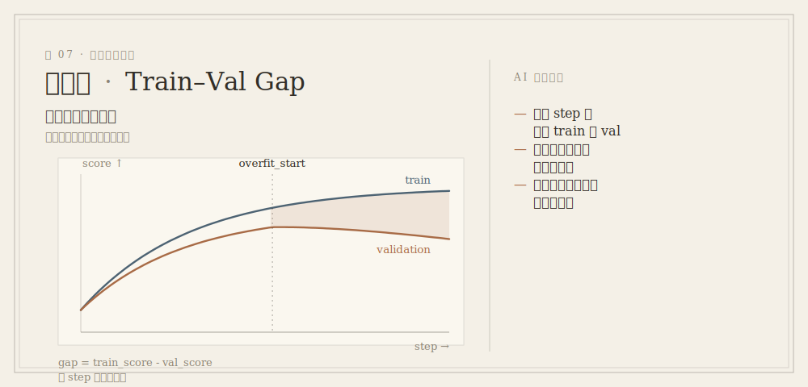
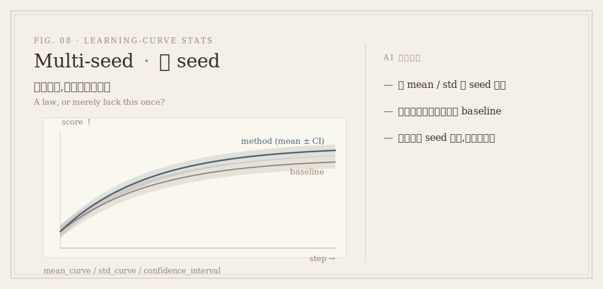

# Learning Curve Stats Skill

[](SKILL.md)
[](LICENSE)
[](SKILL.md)

让 AI 不只是“看训练曲线”，而是用统计证据理解训练过程。

[English README](README.md)

`learning-curve-stats` 是一个面向 Codex、Claude 和其他 AI coding agent 的轻量 skill。它告诉 agent：面对 TensorBoard、W&B、MLflow、CSV、JSONL 或训练日志里的 learning curve 时，应先把曲线转成可解释的统计量，再判断收敛、过拟合、震荡、平台期、最佳 checkpoint 和下一步调参方向。



## 为什么需要它

很多训练曲线看起来“差不多”，但真实含义完全不同：

- validation loss 停了，是正常收敛，还是学习率太低？
- train loss 还在降，validation metric 不动，是过拟合，还是验证集太小？
- 曲线很抖，是 batch 太小、LR 太高，还是 RL/reward 本身方差大？
- 最后一个 checkpoint 真的是最好的吗？
- 新方法比 baseline 好，还是只是在一个 seed 上刚好运气好？

这个 skill 的目标是让 agent 避免凭肉眼猜图，而是输出类似这样的证据：

```json
{
  "diagnosis": "overfitting_after_step_4200",
  "best_step": 3900,
  "recent_val_slope": -0.0008,
  "train_val_gap_slope": 0.0031,
  "roughness": "medium",
  "spike_count": 2,
  "recommendation": "use earlier checkpoint, add regularization, or reduce training length"
}
```

## Agent 学会做什么



核心原则：

> 优先读取原始 scalar history，而不是只看截图。图有用，但诊断应该来自数字。

## 统计图谱

每一种统计，都是向曲线提出的一个问题。左侧是典型 learning curve，右侧是 AI 由此读出的信息。

### Smoothing · 平滑


### Slope · 斜率


### Acceleration · 加速度


### Roughness & Noise · 噪声


### Spikes & Instability · 异常尖峰


### Plateau & Best Checkpoint · 平台期与最佳 checkpoint


### Train-Validation Gap · 泛化差


### Multi-Seed Comparison · 多 seed 比较


## 统计工具能揭示什么

| 统计工具 | 衡量什么 | Agent 能推断什么 |
| --- | --- | --- |
| `EMA` / moving average | 噪声背后的平滑趋势 | 训练是否真的在改善，还是只是在波动 |
| `rolling_median` | 对 spike 更稳健的趋势 | 坏 batch 或评估离群点是否扭曲了曲线 |
| `Savitzky-Golay` / LOWESS | 适合求导的平滑曲线 | 局部斜率、加速度、拐点、warmup 行为 |
| `slope = d(score)/d(step)` | 改善速度 | 还在学习、平台期，还是变差 |
| `early_slope`, `mid_slope`, `late_slope` | 分阶段学习速度 | 学习是否正常放缓，还是过早停滞 |
| `acceleration = d2(score)/d(step)^2` | 改善速度是否变化 | warmup/scheduler 是否有效，是否接近收敛 |
| `residual_std` | 平滑趋势周围的噪声 | 优化噪声、batch 过小、验证集方差、reward 方差 |
| `roughness = mean(abs(second difference))` | 曲线锯齿程度 | 学习率过高、数据管线不稳、混合精度问题 |
| `spike_count` / `max_spike` | 突然异常跳变 | 坏 batch、数值溢出、评估 nondeterminism、日志 bug |
| `sign_change_rate` | 趋势方向翻转频率 | 震荡、不稳定优化、指标噪声 |
| `max_drawdown` | 从历史最好点的最大回撤 | checkpoint 是否敏感，final checkpoint 是否危险 |
| `plateau_detected` | 近期斜率接近 0 | 是否该停训、调 LR、增大容量或加数据 |
| `best_step` | 最佳验证点 | 应该选择哪个 checkpoint |
| `overtraining_steps` | 最佳验证点之后继续训练的步数 | 峰值之后是否浪费，是否过拟合 |
| `train_val_gap` | train 和 validation 行为差距 | 泛化差、过拟合、欠拟合 |
| `gap_slope` | 差距是否增长 | 过拟合起点和严重程度 |
| `mean_curve` / `std_curve` | 多 seed 平均和方差 | 方法是否稳健，还是单次运气好 |
| `confidence_interval` | run group 的不确定性 | 新方法是否真的超过 baseline |

## Agent 可以回答的问题

| Agent 想回答的问题 | 推荐统计手段 | 能获得的信息 |
| --- | --- | --- |
| 训练还在有效学习吗？ | recent slope, improvement per 1k steps, remaining gain | 最近阶段是否仍有实质提升，是否值得继续训练 |
| 是否进入平台期？ | plateau detection, late slope, recent-window regression | 从哪一步开始收益变小，是否应该停训或调整 scheduler |
| 是否过拟合？ | train-validation gap, gap slope, best validation step | train 继续变好但 validation 变差的起点和严重程度 |
| 曲线是否太抖？ | residual std, roughness, rolling std, sign-change rate | 优化是否不稳定，LR/batch/eval 方差是否可能有问题 |
| 有没有异常 spike？ | robust residual threshold, MAD, max spike | 是否存在坏 batch、数值溢出、评估 nondeterminism 或日志异常 |
| 学习速度是在变快还是变慢？ | acceleration, stage-wise slope | warmup/scheduler 是否生效，模型是否接近收敛 |
| 最佳 checkpoint 是哪一个？ | best_step, max drawdown, overtraining steps | final checkpoint 是否可靠，是否应该回滚到验证集最佳点 |
| 新方法真的比 baseline 好吗？ | matched-budget comparison, mean/std across seeds, confidence interval | 提升是否超过 seed 方差，是否只是单次实验运气好 |
| 是欠拟合还是训练不足？ | train slope, validation slope, gap size, final metric | 模型容量、训练时长、学习率或数据是否可能不足 |
| 该调什么超参？ | slope + roughness + gap combined diagnosis | LR、batch size、regularization、scheduler、训练长度的优先级 |

## 如何读这些数字

### 指标方向

先把指标统一成越大越好的 `score`：

```text
loss 类指标: score = -metric
accuracy 类指标: score = metric
```

这样 slope、gap、acceleration 在 loss、accuracy、Dice、IoU、F1、reward、perplexity、error rate 上都能统一解释。

### 斜率

- `slope > 0`：模型在改善。
- `slope ~= 0`：大概率进入平台期。
- `slope < 0`：validation 行为正在变差。

曲线有噪声时，用窗口回归估计斜率，不要只看相邻两点。

### 加速度

- `acceleration > 0`：改善速度在增加，常见于 warmup 后。
- `acceleration ~= 0`：近似线性进展或平台。
- `acceleration < 0`：改善速度在变慢，常见于接近收敛。

加速度对噪声敏感，应从平滑曲线估计，并按窗口报告。

### Roughness 和残差噪声

高 roughness 或高 residual noise 可能意味着：

- 学习率太高
- batch size 太小
- 验证集太小或太噪
- reward 方差大
- 数据管线不稳定
- 混合精度溢出或坏 batch

低 roughness 也不一定好。如果曲线很平滑但不提升，可能是欠拟合或学习率太低。

### Train-Validation Gap

比较 train 和 validation 前，先按 step 对齐。

- train 和 validation 都提升，gap 稳定：健康收敛。
- train 提升，validation 变差，gap 增长：过拟合。
- train 和 validation 都差：欠拟合、优化问题、训练不足或数据问题。
- validation 比 train 好并非不可能，可能来自 dropout、augmentation、label smoothing 或更容易的验证集。

## 示例诊断

### Healthy Convergence

```text
Evidence:
- validation score slope remains positive but decreases smoothly
- train-validation gap is stable
- roughness is low to medium
- best checkpoint is close to final checkpoint

Diagnosis:
healthy_convergence

Action:
continue if recent slope is still meaningful; otherwise stop or reduce LR.
```

### Overfitting

```text
Evidence:
- train score keeps improving
- validation score slope becomes negative
- train-validation gap slope is positive
- best_step is much earlier than final_step

Diagnosis:
overfitting_after_best_step

Action:
use the best validation checkpoint, add regularization, improve data, or stop earlier.
```

## 安装

```bash
git clone https://github.com/Bardli/learning-curve-stats-skill.git
```

然后让 agent 使用这个 skill：

```text
Use the learning-curve-stats skill to analyze these TensorBoard metrics.
Tell me whether the run is overfitting, plateaued, unstable, or still improving.
```

## 支持输入

- TensorBoard event files
- W&B run history
- MLflow metric history
- `metrics.csv`
- `metrics.jsonl`
- 可解析 step/metric 的训练日志
- 只有在没有原始 scalar 数据时，才退而使用曲线截图

## 当前不是

这个 repo 目前是 AI skill 指令，不是完整的 metric parser 或 plotting CLI。它适合指导一个已经能读取文件、运行 Python/R 或查询 experiment tracker 的 agent。

未来可以扩展脚本来支持 TensorBoard 提取、W&B 导出、自动绘图、JSON 证据报告和多 seed 聚合。

## License

MIT
